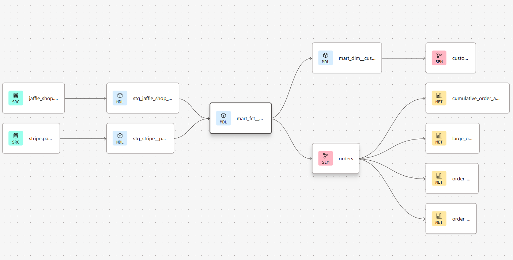
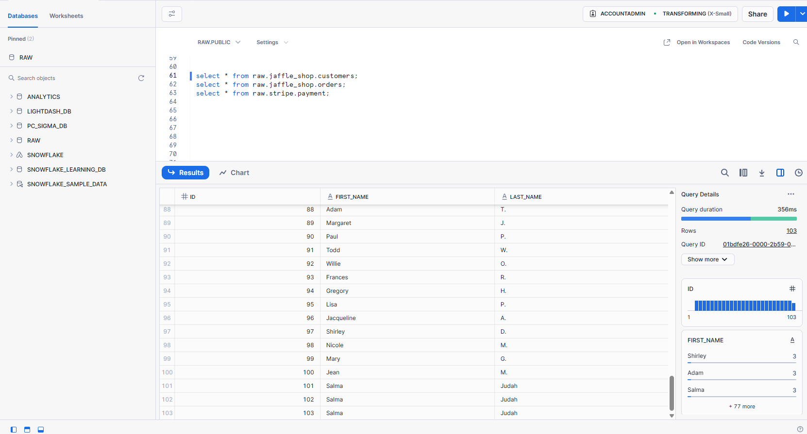
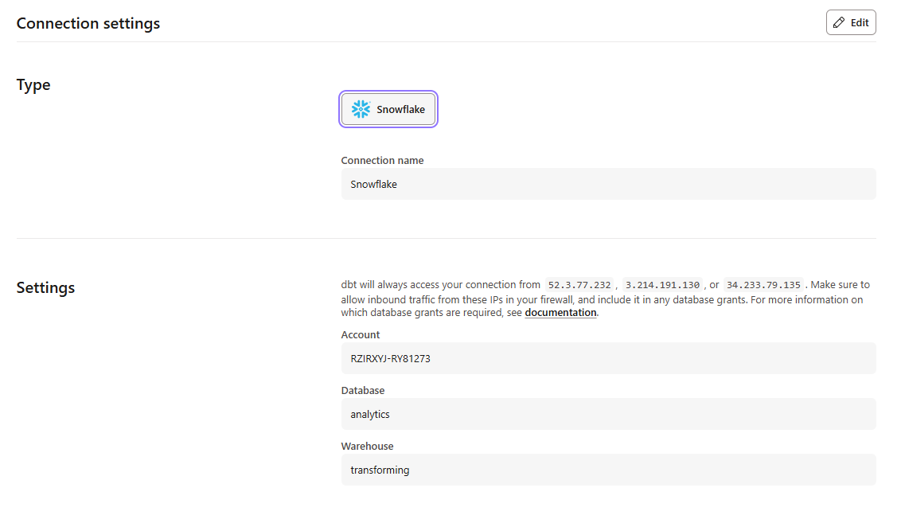
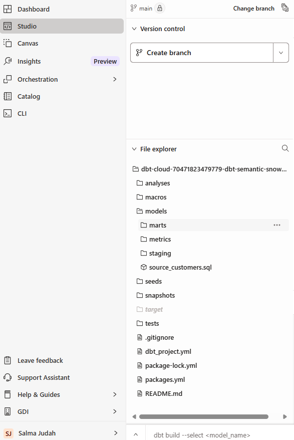
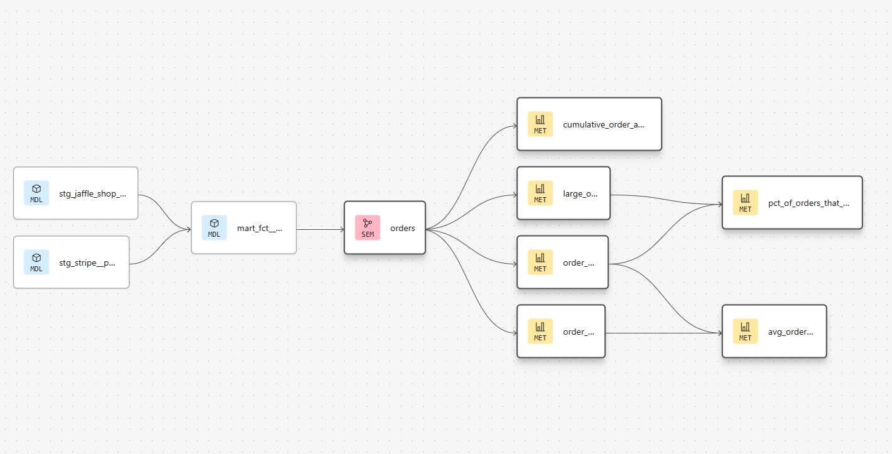
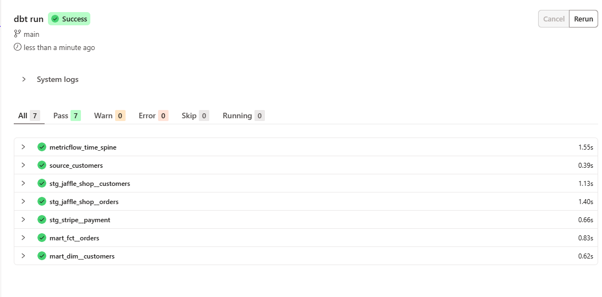
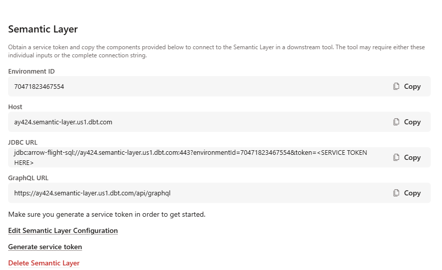
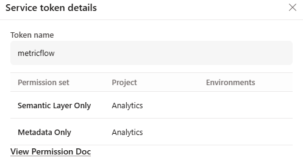
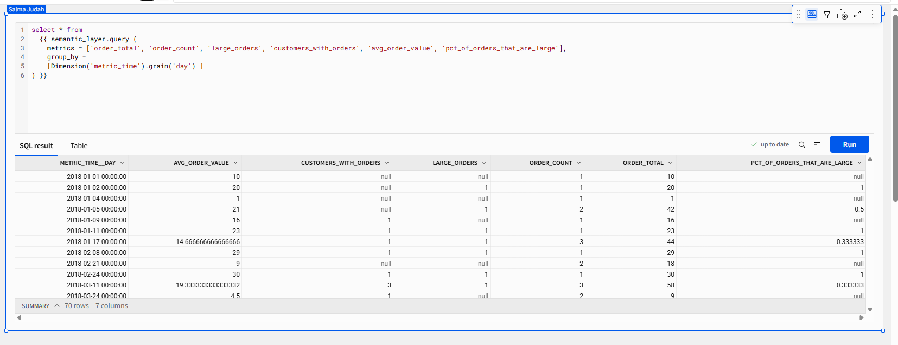
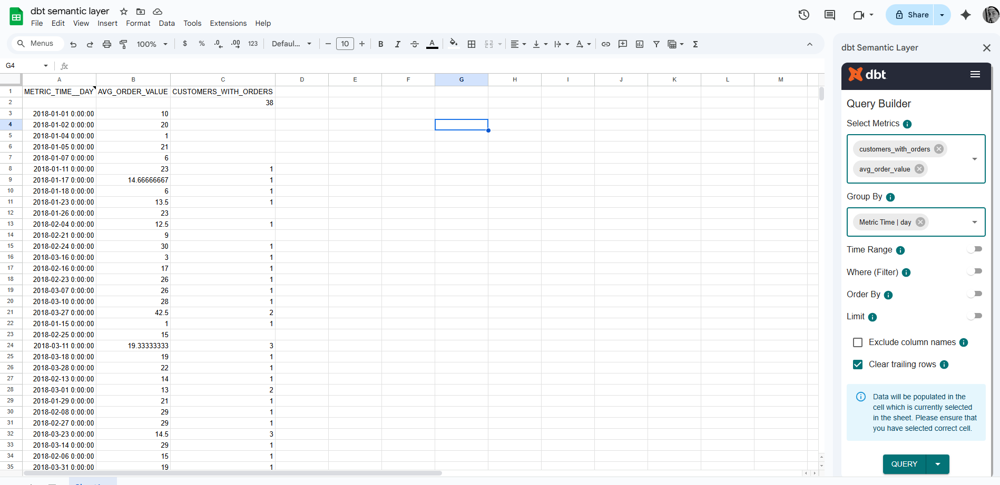

# 🧮 dbt Cloud + Semantic Layer: Metric-Driven Reporting



## 📌 Project Summary

This project demonstrates how to build a metric-centric reporting system using **dbt Cloud** and the **Semantic Layer (MetricFlow)**, integrated with modern BI tools like **Sigma** and **Google Sheets**. It guides users from project initialization through to visual exploration of metrics, using a real business scenario.

## 🧱 Tech Stack

* [dbt Cloud](https://www.getdbt.com/) for data modeling and metric definition
* [Snowflake](https://www.snowflake.com/) as the cloud data warehouse
* [MetricFlow](https://docs.getdbt.com/docs/semantic-layer/metricflow-intro) for defining metric spines
* [Sigma](https://www.sigmacomputing.com/) for data visualization and ad hoc analysis
* [Google Sheets](https://www.google.com/sheets/about/) for data visualization and ad hoc analysis

---

## 🛠️ Project Setup

### 2. Snowflake Setup: Raw Data Integration

I started by inserting the source data into a `RAW` database in Snowflake.  
The data was uploaded manually from S3 buckets and structured into raw tables to ensure accessibility for downstream dbt transformations.




Once the `Raw` layer was in place and verified, I proceeded to model the data using dbt in `Analytics` layer.


### 2. Environment Configuration

* Warehouse: `Transforming`
* Role: `ACCOUNTADMIN`
* Database: `ANALYTICS`
* Schema: `dbt_salma`



---

### 3. dbt Project Initialization

* dbt project created using `dbt init` in Cloud IDE
* Dependencies installed using `dbt deps`
* Folder structure includes models, semantic models, metrics



```bash
$ dbt init semantic-layer-demo
$ dbt deps
```

---

### 4. Semantic Layer & Metrics

#### a. Defining Semantic Models

Created semantic models in the `metrics` directory to describe business entities.

```yaml
semantic_model:
  name: order
  description: Orders semantic model
  defaults:
    agg_time_dimension: order_date
  dimensions:
    - name: order_date
      type: time
  entities:
    - name: customer_id
      type: primary
```

📸 *Insert screenshot of Studio Status button showing "Success" or a resolved error*

#### b. Defining Metrics

Metrics like `order_total`, `order_count`, and `avg_order_value` defined in `fct_orders.yml` using MetricFlow.

```yaml
metrics:
  - name: order_total
    description: Total value of all orders
    type: sum
    sql: amount
```

Use the IDE status button to validate metrics — it shows real-time errors.



On dbt run:



#### c. Semantic Layer Configuration

From dbt Projects:



Save the generated Service Token to use it with GSheets, Excel, or Sigma.



---

### 5. Visualizing Metrics in Sigma

Using Sigma’s SQL editor, you can query metrics directly from the Semantic Layer after integrating with dbt and granting Sigma the correct privilages from Snowflake.

```sql
select * from
  {{ semantic_layer.query (
    metrics = ['order_total', 'order_count', 'avg_order_value'],
    group_by = [Dimension('order_date').grain('day')]
  ) }}
```



### 6. Metrics Analysis in GSheets or Excel

Using dbt semantic layer addon



---

## 🚀 Run the Project Yourself

1. Clone this repo:

```bash
git clone https://github.com/thesalmajudah/dbt-semantic-poc.git
cd dbt-semantic-poc
```

2. Install dependencies:

```bash
dbt deps
```

3. Build the project:

```bash
dbt build
```

4. Query metrics from the Semantic Layer:

```bash
dbt sl list metrics
```

---

## 📚 Further Reading

* [dbt Quickstart for Semantic Layer](https://docs.getdbt.com/guides/sl-snowflake-qs)
* [Set up Semantic Layer](https://docs.getdbt.com/guides/sl-snowflake-qs?step=10)
* [MetricFlow Reference](https://docs.getdbt.com/docs/build/about-metricflow)
* [MetricFlow time spine](https://docs.getdbt.com/docs/build/metricflow-time-spine#configuring-time-spine-in-yaml)
* [MetricFlow Quickstart](https://docs.getdbt.com/guides/mf-time-spine)
* [Sigma Integration with dbt](https://docs.getdbt.com/guides/sl-snowflake-qs?step=12#connect-and-query-with-sigma)
* [Google Sheets Integration](https://docs.getdbt.com/docs/cloud-integrations/semantic-layer/gsheets)
* [Excel Integration](https://docs.getdbt.com/docs/cloud-integrations/semantic-layer/excel)

---

Feel free to contribute or reach out with feedback!
